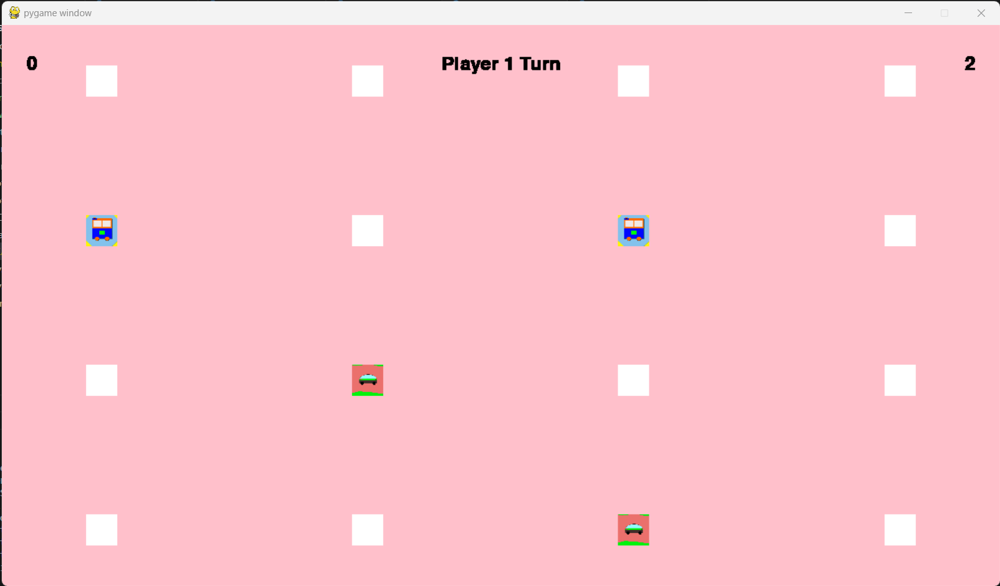

# OpenAI Enabled Memory Game

This is a simple memory game implemented in Python using the Pygame library and OpenAI's API.

### Game Objective

The objective of the game is to match pairs of cards with the same image. The cards are initially shuffled and placed face down. Players can flip two cards at a time to reveal their images. If the images on the flipped cards match, they remain face up. Otherwise, the cards are flipped back face down. The game continues until all pairs of cards have been matched.

### Prerequisites

- Python 3.x: Make sure you have Python 3.x installed on your system. You can download it from the official Python website: https://www.python.org/downloads/
- Pygame: The game relies on the Pygame library for graphics and user input. You can install Pygame using pip: `pip install pygame`

### Running the Game

1. Clone the repository:

   ```
   git clone https://github.com/harshmuriki/memory-game.git
   ```
2. Navigate to the game directory:

   ```
   cd memory-game
   ```
3. Run the game:

   ```
   python game_frontend.py
   ```
4. Get OpenAI's API Key

   ```
   Get OpenAI's API key from https://platform.openai.com/account/api-keys. Paste the API key in variable.env file under OPENAI_API_KEY variable.
   ```

### Game Controls

- Use the mouse to click on the cards and flip them.

### Customization

You can customize various aspects of the game by modifying the code:

- You can customize the game by typing any topic you want the game to be and it uses the OpenAI's API to generate the images.
- You can also change the difficuily of the game by adding more cards into it by increasing the size of the game.

### Game Screenshots




### Contributing

Contributions are welcome! If you would like to contribute to this project, please follow these steps:

1. Fork the repository.
2. Create a new branch for your feature/bug fix.
3. Make your modifications.
4. Commit and push your changes to your forked repository.
5. Submit a pull request detailing your changes.

### License

This project is licensed under the [MIT License](LICENSE).

### Acknowledgments

- The Pygame library: https://www.pygame.org/
- Images used in the game: ChatGPT using OpenAI's API

Feel free to customize the README file according to your specific game implementation. You can add additional sections or provide more detailed instructions based on the features and requirements of your memory game.
